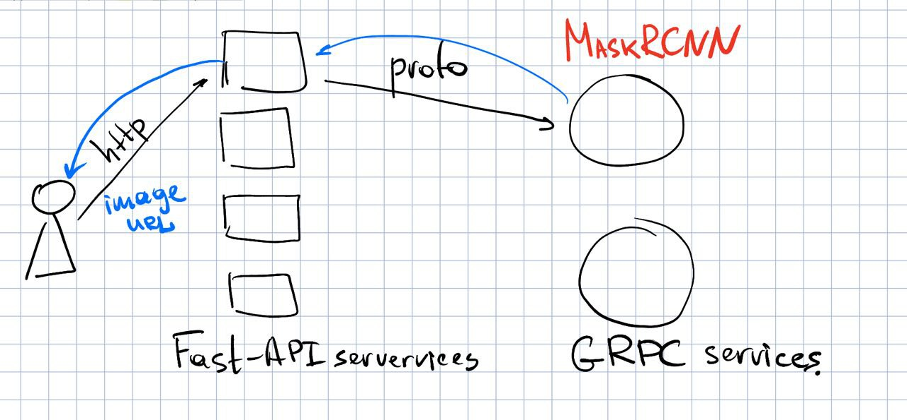

# EfficientMlDeployment
Toy example of microservice ML task (segmentation image) using fastapi(as client API) + gRPC and pretrained `maskrcnn_resnet50_fpn`.

There is also integreation with prometheus metrics via separate endpoint.

Current app endpoints:
- `/predict` via 8080 port – simple HTTP protocol
    ```
       curl -X POST http://localhost:8080/predict -H "Content-Type: application/json" -d '{"url": "https://storage.yandexcloud.net/effdl2022-coco/000000001268.jpg"}'
    ```
- `/metrics` via also 8080 port – with prometheus like metrics. Now it's just request number `app_http_inference_count`
   ```bash
    curl http://localhost:8080/metrics
    # HELP app_http_inference_count_total The number of http endpoint invocations.
    # TYPE app_http_inference_count_total counter
    app_http_inference_count_total 2.0
    # HELP app_http_inference_count_created The number of http endpoint invocations.
    # TYPE app_http_inference_count_created gauge
    app_http_inference_count_created 1.649105295102885e+09
   ```
- `0.0.0.0:9090` – gRPC server with our segmentation model


Scheme of current toy-application.

# How to run
Build from Docker:
```bash
docker build -t efficient_ml .
```

```bash
docker run -it -p 8080:8080 -p 9090:9090 efficient_ml:latest
```

## Comments

file `run_codegen` – to generate `inference_pb2` and `inference_pb2_grpc` files
